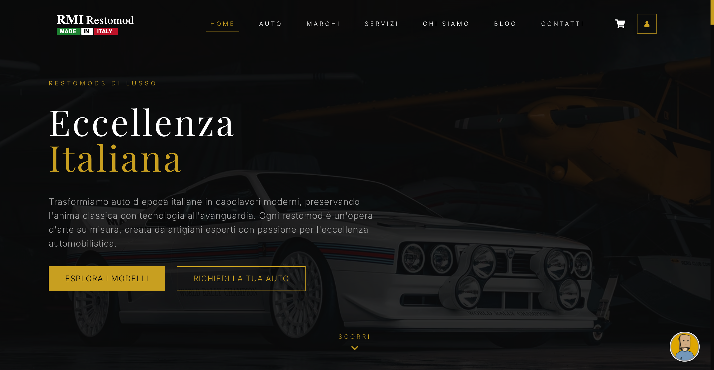

<h1 align="center"> 
   
</h1> 

**RMI Made in Italy** è un'applicazione React moderna per la presentazione e la gestione di auto d'epoca italiane restaurate e modernizzate (restomod). Questo progetto front-end è stato sviluppato per offrire un'esperienza utente premium che riflette l'eccellenza e l'artigianalità del brand. 

<p align="center"> 
  <video src="../img/cover_a.mp4" alt="Cover" width="100%" autoplay loop muted /> 
</p> 

Questo progetto implementa un'interfaccia utente moderna e reattiva utilizzando React e Tailwind CSS, integrando API personalizzate e gestione avanzata dello stato. L'applicazione è costruita seguendo le best practices di sviluppo web moderno, con componenti riutilizzabili e una struttura scalabile. 

### Tecnologie Principali: 
- **React 18**: Framework UI moderno con Hooks e Context API 
- **Vite**: Build tool performante per sviluppo rapido 
- **Tailwind CSS**: Framework CSS utility-first per design responsive 
- **React Router**: Routing dichiarativo per navigazione fluida 
- **Axios**: Client HTTP per comunicazione con il backend 
- **Framer Motion**: Libreria per animazioni fluide e interattive 
- **React Hook Form**: Gestione efficiente dei form 
- **React Slick**: Componenti carousel per showcase di prodotti 

## 📸 Screenshot 

<p align="center"> 
   
</p> 

--- 

## 📌 Funzionalità Principali 
- 🏎️ **Catalogo Restomods**: Visualizzazione dettagliata delle auto restaurate 
- 🔍 **Filtri Avanzati**: Ricerca per marca, modello e caratteristiche 
- 💼 **Gestione Wishlist**: Salvataggio preferiti con Context API 
- 🛒 **Carrello e Checkout**: Processo d'acquisto simulato 
- 👤 **Profilo Utente**: Gestione account e preferenze 
- 📱 **Design Responsive**: Ottimizzato per ogni dispositivo 
- 📝 **Blog Integrato**: Contenuti informativi sul mondo restomod 
- 📅 **Prenotazione Test Drive**: Sistema di appuntamenti 
- 🔧 **Richieste Personalizzate**: Form per progetti custom 
- 💼 **Sezione Carriere**: Opportunità di lavoro 

--- 

## 🔌 API Integration 
Il front-end si integra con il back-end personalizzato sviluppato con Express.js e MongoDB, garantendo una gestione completa ed efficace di tutti i dati dell'applicazione. 

### Principali Endpoint Utilizzati: 
```javascript 
// Autenticazione 
POST   `/api/auth/register`       // Registrazione utente 
POST   `/api/auth/login`          // Login utente 
GET    `/api/auth/profile`        // Profilo utente 

// Gestione Catalogo 
GET    `/api/brands`              // Lista marchi 
GET    `/api/brands/:id`          // Dettaglio marchio 
GET    `/api/restomods`           // Lista restomods 
GET    `/api/restomods/:id`       // Dettaglio restomod 

// Interazioni Utente 
GET    `/api/wishlist`            // Lista preferiti 
POST   `/api/wishlist/:id`        // Aggiungi ai preferiti 
POST   `/api/test-drive`          // Prenota test drive 
POST   `/api/custom-request`      // Richiesta personalizzata 
``` 

--- 

## 📂 Struttura del Progetto 
``` 
src/ 
├── assets/           # Risorse statiche (immagini, font, etc.) 
├── components/       # Componenti React riutilizzabili 
│   ├── common/       # Componenti UI generici 
│   ├── layout/       # Componenti strutturali (header, footer) 
│   └── sections/     # Sezioni specifiche delle pagine 
├── contexts/         # Context API per stato globale 
├── pages/            # Componenti pagina 
│   └── services/     # Pagine dei servizi 
├── services/         # Servizi API e client HTTP 
└── utils/            # Utilities e helpers 
``` 

## ⚙️ Funzionalità Dettagliate 

### Componenti Principali: 
- **Layout**: Struttura base con header, footer e navigazione 
- **RestomodCard**: Card interattiva per visualizzazione auto 
- **TestDriveForm**: Form di prenotazione con validazione 
- **CartContext**: Gestione globale del carrello 
- **AuthContext**: Autenticazione e profilo utente 

### Features Tecniche: 
- Lazy Loading delle immagini 
- Caching delle richieste API 
- Animazioni fluide per transizioni 
- Gestione errori robusta 
- Code splitting automatico 
- Validazione form avanzata 

--- 

## 🚀 Setup Locale 
```bash 
# Clona il repository 
git clone https://github.com/henry8913/7_RMI-Made-in-Italy_Front-end.git 
cd 7_Capstone-Project_RMI-Made-in-Italy/Front-end 

# Installazione dipendenze 
npm install 

# Configurazione ambiente 
cp .env.example .env 
# Modifica il file .env con le tue configurazioni 

# Avvio development server 
npm run dev 

# Build per produzione 
npm run build 
``` 

## ⚠️ Nota Importante 
Questo è un progetto dimostrativo. Le funzionalità di pagamento sono simulate e non vengono processati pagamenti reali. 

## 👤 Autore

Progetto creato da [Henry](https://github.com/henry8913).

## 📫 Contatti

<div align="center">

[](https://henrygdeveloper.com/)
[](https://linkedin.com/in/henry-k-grecchi-555454254)
[](mailto:henry8913@hotmail.it)
[](https://api.whatsapp.com/send/?phone=393926936916&text&type=phone_number&app_absent=0)

</div>


---

## 📄 Licenza

Questo progetto è rilasciato sotto licenza [GNU GPLv3](LICENSE.txt).
